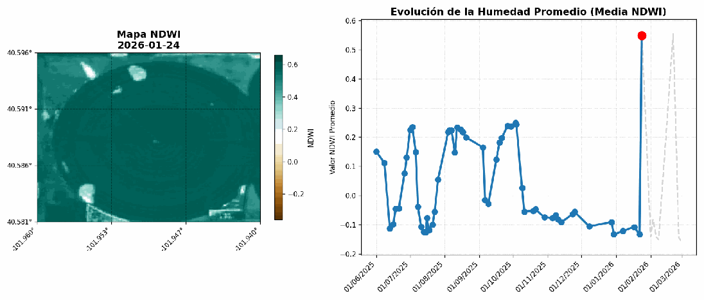
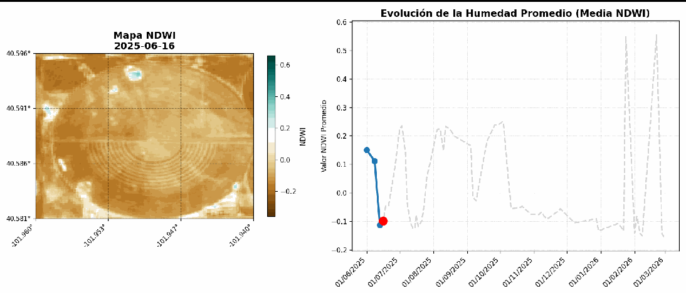
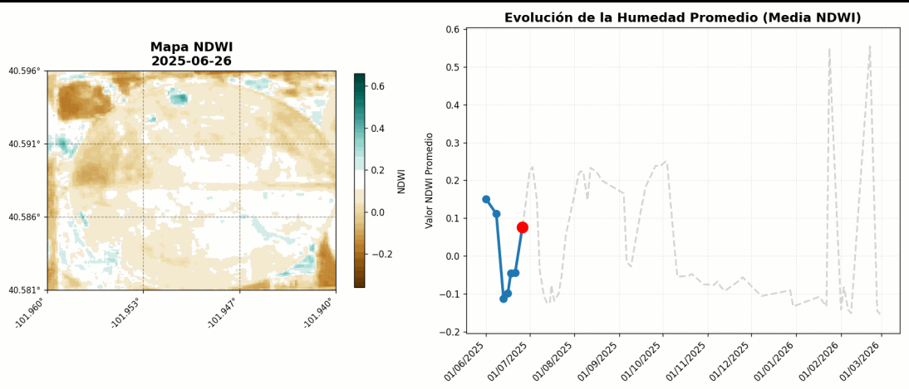
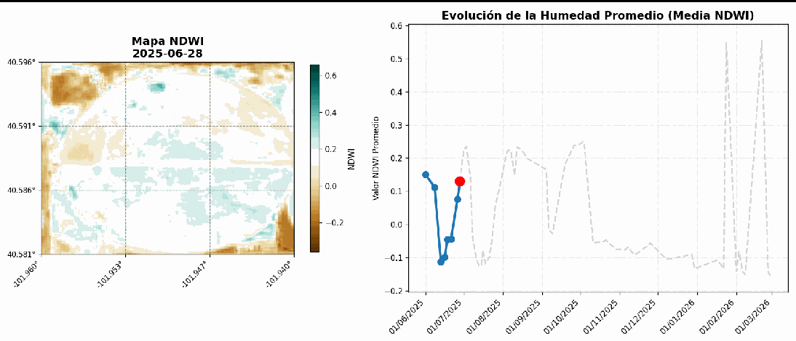
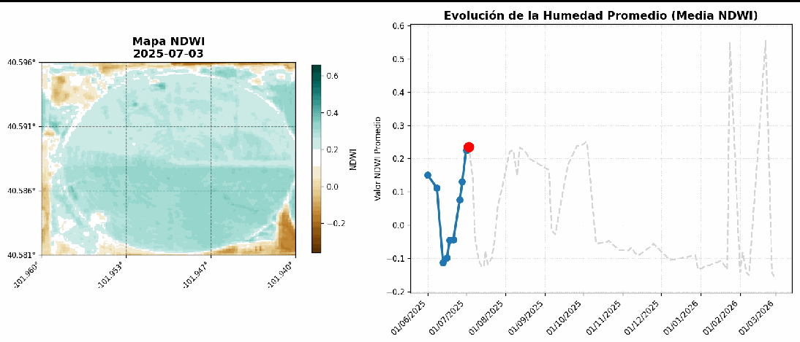

## Resumen

La diferenciación precisa entre eventos de riego aplicados por el agricultor y precipitaciones naturales es un reto en la agricultura de precisión. Aunque las estaciones meteorológicas registran la lluvia, carecen de la resolución espacial necesaria para identificar la concentración y distribución exacta del agua en el terreno. Este trabajo presenta el desarrollo de una herramienta computacional basada en Teledetección que permite realizar consultorías sobre el uso del agua en cultivos al aire libre de forma remota. Mediante el procesamiento de cubos de datos multidimensionales y el cálculo del Índice de Humedad de Diferencia Normalizada (NDWI de Gao), el script desarrollado filtra, procesa y anima series temporales de imágenes satelitales, permitiendo identificar patrones de esquemas de riego y eventos climáticos.

## Introducción

La gestión eficiente de los recursos hídricos en la agricultura requiere una monitorización constante. Frecuentemente, resulta complejo diferenciar si un aumento en la humedad del suelo y del dosel vegetal corresponde a un evento de riego artificial o a una precipitación natural. Las estaciones meteorológicas tradicionales presentan limitaciones significativas, ya que proporcionan datos puntuales que fallan en representar la variabilidad espacial y no permiten saber en qué zonas específicas se pudo haber concentrado el agua dentro de una parcela. 

Para llevar a cabo consultorías sobre el uso adecuado del agua sin depender de visitas presenciales ni de la revisión manual de los equipos de riego (especialmente en cultivos al aire libre), se hace imperativo el uso de la teledetección. La implementación de índices espectrales de vegetación y humedad a través de imágenes satelitales ofrece una solución robusta para monitorear estas dinámicas espaciotemporales.

## Objetivos

**Objetivo General:**
Desarrollar un algoritmo computacional capaz de procesar información satelital mediante cubos multidimensionales (coordenadas geográficas, tiempo e índices espectrales como el NDWI de Gao) para detectar eventos de riego y precipitaciones, facilitando la identificación de esquemas de aplicación hídrica en parcelas agrícolas.

**Objetivos Específicos:**
* Implementar el algoritmo en un entorno de desarrollo accesible y en la nube, como Google Colaboratory.

* Automatizar la ingesta de múltiples imágenes satelitales gratuitas mediante el estándar STAC (Spatio Temporal Asset Catalog).

* Generar productos visuales analíticos que incluyan una animación espacial con leyenda de colores y una gráfica temporal sincronizada para la identificación de picos de humedad correspondientes a los eventos hídricos.

## Área de Estudio

La herramienta desarrollada es versátil y puede ser ejecutada utilizando un *Bounding Box* (BBox) o cuadro delimitador en cualquier parte del mundo. Sin embargo, la restricción principal del algoritmo no radica en la ubicación geográfica, sino en la extensión del área analizada. 

El código está rigurosamente optimizado para evitar la interferencia de nubosidad, filtrando y descartando imágenes que no cumplan con estrictos umbrales de visibilidad. Por esta razón, se recomienda aplicar el estudio sobre fincas o parcelas que no excedan dimensiones de 500 x 500 metros. A medida que el área de interés (ROI) aumenta, crece exponencialmente la probabilidad de que formaciones nubosas locales ingresen en el BBox, lo que resultaría en la descalificación de un gran número de imágenes y en la pérdida de densidad en la serie temporal.

Para la validación de este script, se seleccionó un área delimitada que opera bajo un sistema de riego por pivote central cerca a Kelirav Farms LLC Colorado, Estados Unidos. Este método de irrigación fue elegido estratégicamente debido a que genera una geometría circular altamente distintiva, lo cual facilita enormemente la discriminación visual entre un evento de riego (limitado al círculo) y un evento de precipitación (distribuido uniformemente en todo el paisaje).

## Metodología

El desarrollo del script se estructuró en un flujo de trabajo que abarca desde la adquisición automatizada de datos hasta el renderizado de análisis visuales, apoyándose en diversas librerías especializadas de Python. El código fuente detallado y comentado se encuentra disponible en el repositorio anexo al proyecto.

### Gestión de Datos y Filtrado de Nubosidad
El sistema inicia estableciendo una arquitectura de directorios (por defecto una carpeta denominada `data_heavy`), donde se generan subdirectorios únicos basados en las coordenadas ingresadas por el usuario. Esta estructura permite almacenar localmente las imágenes que superan los filtros de calidad. 

Para garantizar observaciones claras, el algoritmo hace uso de la banda SCL (*Scene Classification*), la cual provee una pre-clasificación sobre la naturaleza de cada píxel (identificando nubes densas, cirros y sombras). Aquellas imágenes cuyo porcentaje de nubosidad exceda el umbral tolerable definido por el usuario son descartadas automáticamente.

### Conexión STAC y Optimización de Consultas
La ingesta de datos se realiza mediante la conexión a la base de datos Planetary Computer de Microsoft a través del protocolo STAC. El algoritmo evalúa el rango temporal día por día, almacenando las imágenes válidas e interaccionando con un archivo de registro (`.json`). Esta bitácora guarda el historial de peticiones, evitando que el sistema re-descargue imágenes o vuelva a procesar días descartados en ejecuciones futuras, lo cual es vital cuando los servidores presentan alta demanda. Asimismo, el sistema contempla la gestión de caché topográfica; si el usuario decide escalar el script para incluir análisis de relieve, el Modelo Digital de Elevación (DEM) descargado debe ser purgado manualmente en caso de cambiar drásticamente la ubicación del BBox.

### Procesamiento Multidimensional e Índices Espectrales
Una vez obtenidas las imágenes, se implementa un procesamiento matricial avanzado. Se generan "cubos multidimensionales" que agrupan latitud, longitud, tiempo y bandas espectrales en una sola estructura de datos. Esto permite calcular dinámicamente el índice NDWI propuesto por Gao (también conocido como NDMI), cuya formulación matemática es:

$$NDWI_{Gao} = \frac{NIR - SWIR}{NIR + SWIR}$$

Este índice es idóneo para la agricultura de precisión, ya que no busca identificar cuerpos de agua estancada, sino cuantificar la humedad contenida en el dosel vegetal y la capa superficial del suelo. Al procesar el cubo de datos completo, el sistema identifica de antemano el valor máximo y mínimo de humedad de toda la serie temporal temporal. Establecer estas cotas absolutas garantiza que la paleta de colores de la animación sea consistente y comparable a lo largo del tiempo.

### Renderizado y Visualización Analítica
La fase final del script integra herramientas de cálculo numérico, manipulación geoespacial y graficación. El sistema extrae las medias de humedad por imagen y genera una composición visual de doble panel (frame). Cada frame contiene el mapa georreferenciado del BBox proyectado sobre una cuadrícula de 9 sectores, y una gráfica de líneas adyacente que rastrea la evolución temporal de la media. Finalmente, estos fotogramas individuales se compilan computacionalmente para renderizar un archivo GIF animado, almacenado en el directorio del proyecto.

## Resultados

Para la prueba de concepto, el sistema fue inicializado con los siguientes parámetros básicos:

* **Bounding Box (BBOX):** `[-101.959920, 40.581314, -101.940436, 40.596109]`
* **Ventana de Observación:** `2025-06-01` a `2026-02-28`

Bajo esta configuración, el algoritmo logró recuperar satisfactoriamente más de 50 imágenes válidas libres de nubes. Esta alta densidad de datos es atribuible al tamaño reducido del área de estudio en relación con los ocho meses de monitoreo. El tiempo de ejecución para la descarga y procesamiento fue de aproximadamente 2 minutos, un rendimiento que variará en función de la amplitud de la ventana temporal definida.

El producto final permite observar de manera evidente los picos en la gráfica temporal que corresponden al riego planificado por el pivote central. Destacan de manera particular los dos últimos picos de la serie, los cuales exhiben un aumento drástico y abrupto en los valores del índice de humedad.

Al contrastar la gráfica con la información espacial del mapa animado, se evidencia que durante estos dos últimos picos, el incremento de los valores NDWI tiene una distribución espacial homogénea que excede los límites de la parcela circular. Esto confirma categóricamente que se trató de eventos de precipitación pluvial generalizada. Este hallazgo subraya la importancia de la visualización espacial: los promedios numéricos puros a menudo ocultan información contextual, pero el apoyo del mapa georreferenciado permite discriminar el origen del agua.

Para apreciar las dinámicas descritas, la animación generada debe ser descargada del entorno de trabajo (notebook) y puede ser ejecutada en cualquier visor estándar de imágenes.

## Análisis de las Dinámicas Hídricas

La serie temporal de imágenes, aunque sujeta a la disponibilidad por paso del satélite, revela un claro patrón de frecuencias en la toma de decisiones. Se puede observar que las aplicaciones de riego ocurren durante varios días consecutivos, una estrategia evidente para acumular y garantizar la retención de humedad en el perfil del suelo. 

Tanto la representación espacial como la gráfica temporal demuestran que las recargas de humedad no suceden de manera gradual, sino en escalones abruptos. Espacialmente, el rastro de humedad permite trazar la posición del brazo del pivote central, evidenciando cómo completa la circunferencia en múltiples ciclos para acumular la lámina de aplicación hídrica deseada.

En contraste, los dos últimos picos de la serie representan datos atípicos respecto a la frecuencia de riego previamente identificada. Estos eventos registran los valores más altos de NDWI de Gao en toda la ventana de observación, presentándose de manera repentina y elevando los niveles de humedad tanto en la zona interior de la parcela circular como en los suelos periféricos carentes de infraestructura de riego.

## Conclusiones

Se desarrolló y validó con éxito una herramienta de software fundamentada en la teledetección y el procesamiento de cubos multidimensionales. El producto final, una animación analítica sincronizada, empodera tanto a investigadores como a productores agrícolas para auditar e identificar la naturaleza de los eventos hídricos sin necesidad de monitoreo in situ. 

El algoritmo cumplió con el objetivo principal de facilitar la interpretación del manejo del riego. Se deja el script a disposición abierta de la comunidad para fomentar su uso, modificación y refinamiento.

Como trabajo futuro para optimizar los resultados y aumentar la densidad de la serie temporal, se propone integrar un módulo de autenticación que permita a los usuarios utilizar sus credenciales personales frente a los proveedores de datos espaciales, obteniendo así prioridad en el ancho de banda y en los límites de descarga de imágenes.

## Fuentes
Gao, B. C. (1996). NDWI—A normalized difference water index for remote sensing of vegetation liquid water from space. *Remote Sensing of Environment*, 58(3), 257-266. https://doi.org/10.1016/S0034-4257(96)00067-3

Uribe C., H., Lagos, L. O., & Holzapfel, E. (2001). *Pivote Central*. Instituto de Investigaciones Agropecuarias (INIA), Centro Regional de Investigación Carillanca / Comisión Nacional de Riego. Ministerio de Agricultura, Gobierno de Chile.

## Codigo completo

https://github.com/jeibogo/Detecci-n-Din-mica-de-Eventos-de-Riego.git